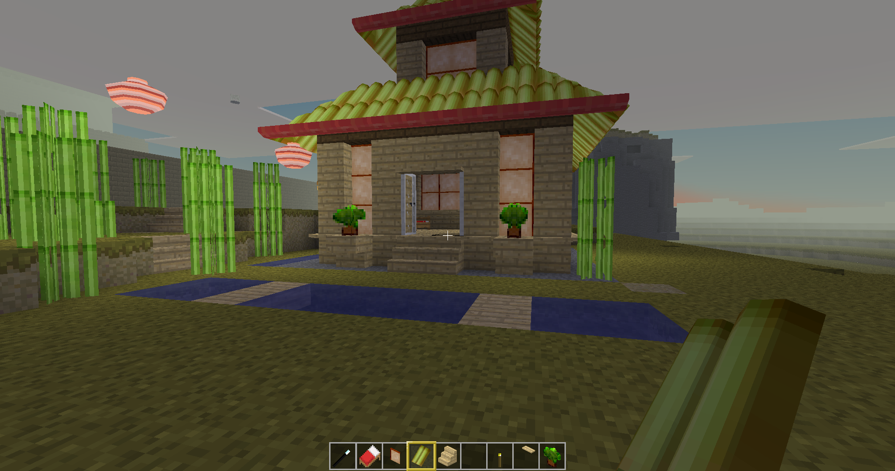

# mt-orient
minetest orient mod

adds a set of oriental style decor blocks and entities to minetest, all original artwork

## dev-dependencies
- [mt-api](https://github.com/RepComm/mt-api)
- [typescript-to-lua](https://github.com/TypeScriptToLua/TypeScriptToLua)
- [lua-types](https://github.com/TypeScriptToLua/lua-types)
- [typescript](https://github.com/microsoft/TypeScript)
